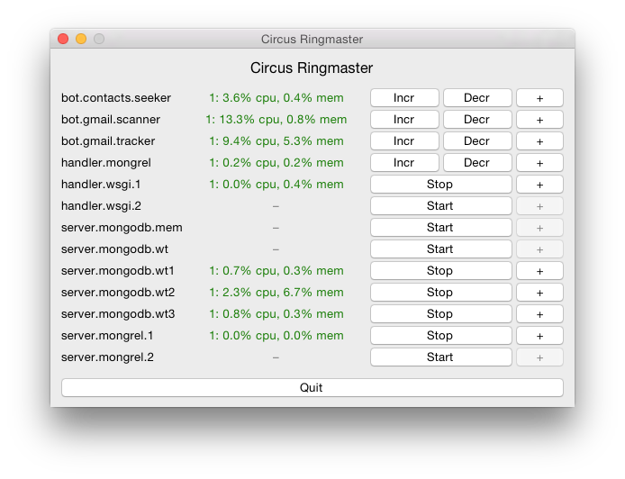

# ringmaster

Circus Ringmaster. A Tcl/Tk Control Panel for Circus.

[Circus](http://github.com/circus-tent/circus) is a program that runs and
watches processes and sockets.

Circus Ringmaster is a Tck/Tk interface to monitor, start and stop those
processes.

To the left, on the image above, are the Circus watchers. In the center, a
green string indicates the number of processes of the watcher, the current use
of CPU, and memory. To the right, command buttons – **incr**/**decr** for
normal watchers; and **start**/**stop** for singleton watchers.

## Requirements

Ringmaster is built on top of Python 3.4 (**asyncio**) and
[aiozmq](https://github.com/aio-libs/aiozmq).

Circus itself is not a code dependency, but without it this program does not
have much use.

## Installation

Latest release.

    pip install ringmaster

Latest commit on the master branch of the project's Git repository.

    mkdir ringmaster
    cd ringmaster
    curl -L https://github.com/viotti/ringmaster/tarball/master | tar -xz --strip-components 1 -
    python setup.py sdist
    pip install dist/ringmaster-*.tar.gz

## Basic Use

Just type **ringmaster**. There is no command line option.

    ringmaster

The program will establish communication with the Circus daemon and display
the watchers on its GUI.

## Troubleshooting

### MacPorts on OS X

The Python 3.4 MacPorts distribution present a series of dificulties to run
Ringmaster on a OS X computer.

First, it does not come with the **tkinter** library, which is provided as a
separate pacakge.

Second, it will install the Ringmaster executable script in a nonstandard
location (`/opt/local/Library/Frameworks/Python.framework/Versions/3.4/bin`).

To prevent issues, use the following installation steps.

    sudo port selfupdate
    sudo port install py34-tkinter py34-pip
    sudo pip-3.4 install ringmaster --install-option='--install-scripts=/usr/local/bin'

Finally, if you install Ringmaster on a virtual environment created with
**virtualenv-3.4** from MacPorts, it will abort with a **ImportError: No module
named '_tkinter'** exception. This is because the virtual environment
insultates itself from Python packages installed in the system. The solution
here is to link the Tkinter shared object to the **site-packages** directory
of the environment.

    ln -s $(port -q contents py34-tkinter | grep _tkinter.so) $VIRTUAL_ENV/lib/python3.4/site-packages

## TODO

* Implement command line options for the connection endpoints.
* Improve the watcher details dialog.
